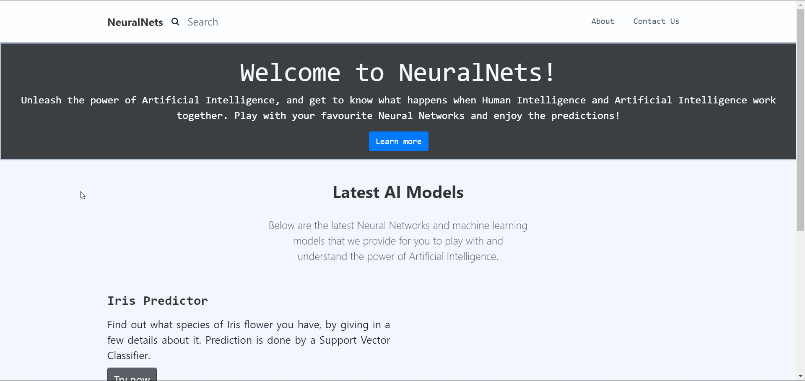
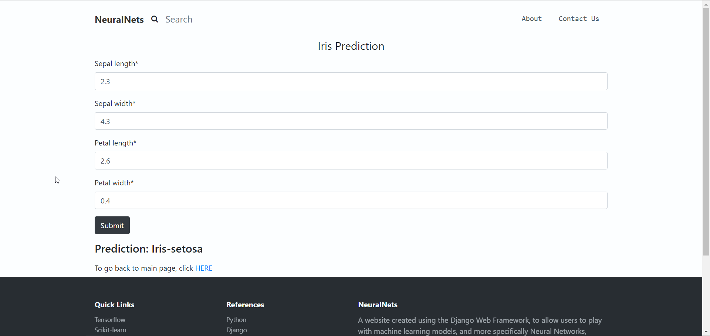

# NeuralNets
Website developed using Django Web Framework. Hosts several trained Neural Networks and ML models.

Main Website:

Iris App:

In order to use this website, simply clone the repo and run the server (development).

`git clone https://github.com/Gautam-J/NeuralNets.git`

`python -m pip install -r requirements.txt`

`python manage.py runserver`
